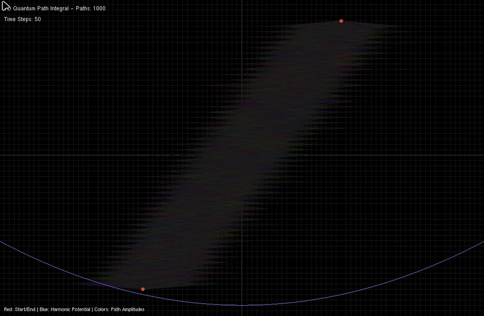

# 1D-quantum-path-integral-sim
This project implements a 1D quantum mechanical path integral simulation using the lattice discretization method.
The simulation visualizes how quantum particles can take all possible paths between two fixed points, with each path colored
according to its quantum amplitude.
## Documentation

For detailed explanations of the physics behind the simulation, see the [Detailed documentation](docs/Info/physics_info.md).


---





## Visualization Guide

- **Red dots**: Start and end positions (x₀ = -2, x_f = 2)  
- **Colored paths**: Quantum paths colored by amplitude  
- **Hue**: Represents quantum phase `arg(e^{iS/ℏ})`  
- **Brightness**: Represents amplitude magnitude `|e^{iS/ℏ}|`  
- **Blue curve**: Harmonic oscillator potential `V(x) = ½x²`  
- **Grid lines**: Lattice discretization visualization  

---


## Prerequisites

### For Desktop Version (OpenGL/GLUT)

#### Linux (Ubuntu/Debian)
```bash
sudo apt-get update
sudo apt-get install build-essential cmake
sudo apt-get install freeglut3-dev libglu1-mesa-dev mesa-common-dev
````

#### Linux (Arch/Manjaro/EndeavourOS)
```bash
sudo pacman -Syu
sudo pacman -S base-devel cmake freeglut glu mesa
```

#### Linux (Red Hat/CentOS/Fedora)

```bash
sudo yum install gcc-c++ cmake
sudo yum install freeglut-devel mesa-libGLU-devel
# OR for newer versions:
sudo dnf install gcc-c++ cmake
sudo dnf install freeglut-devel mesa-libGLU-devel
```

#### Linux (Arch/Manjaro/EndeavourOS)
```bash
sudo pacman -Syu
sudo pacman -S base-devel cmake freeglut glu mesa
```

#### macOS

```bash
# Install Xcode command line tools
xcode-select --install

# Install Homebrew if not already installed
/bin/bash -c "$(curl -fsSL https://raw.githubusercontent.com/Homebrew/install/HEAD/install.sh)"

# Install dependencies
brew install cmake
# GLUT is included with macOS by default
```

#### Windows

* Install Visual Studio 2019 or later with C++ development tools
* Install CMake: Download from [https://cmake.org/download/](https://cmake.org/download/)
* Install vcpkg (optional but recommended):

```cmd
git clone https://github.com/Microsoft/vcpkg.git
cd vcpkg
.\bootstrap-vcpkg.bat
.\vcpkg integrate install
```

Install GLUT via vcpkg:

```cmd
.\vcpkg install freeglut:x64-windows
```

---

### For Web Version (Emscripten)

```bash
# Install Emscripten
git clone https://github.com/emscripten-core/emsdk.git
cd emsdk
./emsdk install latest
./emsdk activate latest
source ./emsdk_env.sh
```

---

## Building and Running

### Desktop Version

#### Using CMake (Recommended)

```bash
git clone <your-repo-url>
cd quantum-path-integral
mkdir build && cd build
cmake ..
make
./QuantumPathIntegral
```

#### Manual Compilation

**Linux/macOS:**

```bash
g++ -o quantum_simulation src/main.cpp -lGL -lGLU -lglut -std=c++11 -O2
./quantum_simulation
```

**Windows (with MinGW):**

```cmd
g++ -o quantum_simulation.exe src/main.cpp -lfreeglut -lopengl32 -lglu32 -std=c++11 -O2
quantum_simulation.exe
```

**Windows (with Visual Studio):**

```cmd
cl /EHsc src/main.cpp /link freeglut.lib opengl32.lib glu32.lib
```

---

### Web Version

#### Using the Compilation Script

```bash
cd web
chmod +x compile_web.sh
./compile_web.sh
```

#### Manual Web Compilation

```bash
emcc src/main_web.cpp -o web/index.html \
  -s USE_WEBGL2=1 \
  -s ALLOW_MEMORY_GROWTH=1 \
  -s EXPORTED_FUNCTIONS="['_main','_setLatticeSize','_setTimeSteps','_setNumPaths','_setHbar','_setMass','_setDt','_setDx','_regeneratePaths']" \
  -s EXPORTED_RUNTIME_METHODS="['ccall','cwrap']" \
  --shell-file web/shell_minimal.html \
  -O2 -std=c++11
```

---

### Running the Web Version

```bash
cd web
python -m http.server 8000
# Open browser to http://localhost:8000/index.html
```

## Controls

### Desktop Version
- **R key**: Regenerate paths with new random sampling  
- **ESC key**: Exit simulation

### Web Version[Recommended Controls]
- **R key**: Regenerate paths  
- **Mouse click**: Regenerate paths  
- **Parameter sliders**: Real-time adjustment of simulation parameters  
- **Auto-regeneration**: Paths automatically regenerate every 3 seconds


---
## Customization

### Web Version JavaScript API

```js
// Adjust simulation parameters in real-time
Module.ccall('setNumPaths', null, ['number'], [1000]);
Module.ccall('setHbar', null, ['number'], [0.5]);
Module.ccall('setMass', null, ['number'], [2.0]);
Module.ccall('regeneratePaths', null, [], []);
```

### Adding New Potentials

Modify the V(double x) function in the source code:
```cpp
double V(double x) {
    // return 0.5 * x * x;           // Harmonic oscillator
    // return x > 0 ? 1.0 : 0.0;     // Step potential  
    // return -1.0 / (x*x + 1.0);    // Attractive potential
}
```

---

## Simulation Parameters

- **ℏ (Planck's constant)**: Controls quantum behavior strength  
- **Mass**: Particle mass affecting kinetic energy  
- **Time Steps**: Lattice resolution in time dimension  
- **Number of Paths**: Monte Carlo sample size (affects accuracy and performance)  
- **dt**: Time step size for discretization  
- **dx**: Spatial step size for discretization  

---

## Troubleshooting

### Common Build Issues

**Linux: "GL/glut.h not found"**  
```bash
sudo apt-get install freeglut3-dev
```

**macOS: "GL/glut.h not found"**

    Use the included GLUT framework

    Change #include <GL/glut.h> to #include <GLUT/glut.h> if needed

**Windows: Linker errors**

    Ensure freeglut, OpenGL32, and GLU32 libraries are properly linked

    Check that library paths are correctly set in your IDE

**Web Version: Module not loading**

    Ensure you're serving files over HTTP, not opening index.html directly

    Check browser console for WebGL support issues

**Performance Issues**

    Reduce number of paths for better performance

    Decrease time steps if simulation is too slow

    On web, consider lowering path count for mobile devices

---
